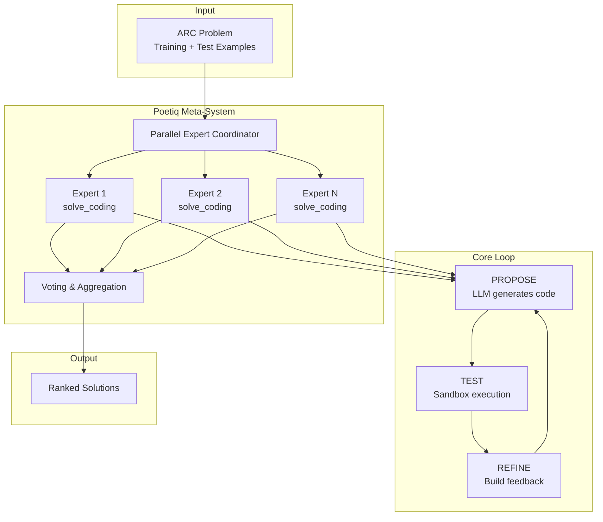

# Architecture Overview

Poetiq ARC-AGI Solver is a state-of-the-art system for solving abstract reasoning tasks. This document explains the high-level architecture and why each design decision contributes to achieving record-breaking results.

## System Overview



## Data Flow

```
┌─────────────────┐
│  ARC Problem    │  Input: training pairs + test inputs
└────────┬────────┘
         │
         ▼
┌─────────────────┐
│  main.py        │  Orchestrates solving across problems
└────────┬────────┘
         │
         ▼
┌─────────────────┐
│  solve.py       │  Entry point, loads expert configs
└────────┬────────┘
         │
         ▼
┌─────────────────────────────────────────────────┐
│  solve_parallel_coding.py                       │
│  Spawns N parallel experts, aggregates results  │
└────────┬────────────────────────────────────────┘
         │
         ├──────────────┬──────────────┐
         ▼              ▼              ▼
┌─────────────┐  ┌─────────────┐  ┌─────────────┐
│  Expert 1   │  │  Expert 2   │  │  Expert N   │
│  (seed=0)   │  │  (seed=10)  │  │  (seed=N*10)│
└──────┬──────┘  └──────┬──────┘  └──────┬──────┘
       │                │                │
       └────────────────┴────────────────┘
                        │
                        ▼
              ┌─────────────────┐
              │  Voting System  │  Group by output, rank by confidence
              └────────┬────────┘
                       │
                       ▼
              ┌─────────────────┐
              │  Best Solutions │  Up to 2 attempts for Kaggle
              └─────────────────┘
```

## Project Structure

| Concept | File Path | Description |
|---------|-----------|-------------|
| **Entry Point** | `arc_agi/solve.py` | Main script to load configs and start solvers. |
| **Coordinator** | `arc_agi/solve_parallel_coding.py` | Spawns N parallel experts and aggregates votes. |
| **Expert Logic** | `arc_agi/solve_coding.py` | Implements the Propose-Test-Refine loop. |
| **Configuration** | `arc_agi/config.py` | Defines `ExpertConfig` and parameter sets (e.g., Poetiq variants). |
| **Execution** | `arc_agi/sandbox.py` | Securely runs generated Python code. |
| **Scoring** | `arc_agi/scoring.py` | Validates solutions using strict grid equality. |

## Key Configuration Parameters

The system behavior is controlled by `ExpertConfig` in `arc_agi/config.py`. Key parameters include:

*   **`num_experts`**: Number of parallel expert instances to spawn (e.g., 1, 2, 8).
*   **`max_iterations`**: Maximum "Propose-Test-Refine" loops per expert (e.g., 10).
*   **`llm_id`**: The model identifier (e.g., `gemini/gemini-3-pro-preview`).
*   **`return_best_result`**: Enables the "Self-Auditing" mechanism to exit early if training examples pass.

## Core Modules

| Module | Responsibility | Why It Matters |
|--------|----------------|----------------|
| `solve_coding.py` | Single-expert iteration loop | The core innovation: propose-test-refine |
| `solve_parallel_coding.py` | Multi-expert coordination | Diversity through parallel exploration |
| `llm.py` | LLM API abstraction | Model-agnostic, rate-limited, fault-tolerant |
| `sandbox.py` | Secure code execution | Safe testing of generated Python code |
| `prompts.py` | Prompt templates | Multiple strategies for different models |
| `config.py` | Expert configurations | Tuneable hyperparameters per model |

## Why This Architecture Achieves SOTA

### 1. Separation of Concerns

The system cleanly separates:
- **Coordination** (parallel experts, voting) from **solving** (iteration loop)
- **Generation** (LLM calls) from **validation** (sandbox execution)
- **Configuration** (prompts, models) from **logic** (algorithms)

This allows mixing and matching components without changing core algorithms.

### 2. Model-Agnostic Design

The architecture doesn't depend on any specific LLM. The same system works with:
- Google Gemini (2.5, 3.0)
- OpenAI GPT (5, 5.1)
- Anthropic Claude (Sonnet, Haiku)
- xAI Grok (4)
- Open-weight models (GPT-OSS)

This is achieved through:
- LiteLLM abstraction layer
- Model-specific configuration (thinking budgets, rate limits)
- Prompt templates that work across models

### 3. Cost-Efficiency by Design

The architecture optimizes cost at every level:
- **Early exit**: Stop as soon as training examples pass
- **Soft scoring**: Track partial progress to guide refinement
- **Voting**: Use agreement to identify high-confidence solutions
- **Single attempt average**: Less than 2 API calls per problem

### 4. Fault Tolerance

The system handles failures gracefully:
- API timeouts don't crash the solver
- Rate limits trigger backoff, not failure
- Best partial solution returned if no perfect match found

## Technology Stack

| Technology | Purpose |
|------------|---------|
| Python 3.11+ | Async/await for concurrency |
| LiteLLM | Unified API for multiple LLM providers |
| AsyncIO | Non-blocking parallel expert execution |
| asynciolimiter | Per-model rate limiting |
| NumPy | Grid manipulation and comparison |

## Configuration Philosophy

The system uses a single `ExpertConfig` type with 22 parameters covering:
- **Model selection**: Which LLM to use
- **Iteration control**: How many attempts, how many solutions to track
- **Prompt selection**: Which strategy to use
- **Voting options**: How to aggregate results

This allows creating different "Poetiq variants" (a, b, c) by simply changing configuration, not code.

## Next Steps

- [02-propose-test-refine-loop.md](./02-propose-test-refine-loop.md) - Deep dive into the core iteration loop
- [03-self-auditing-mechanism.md](./03-self-auditing-mechanism.md) - How the system knows when to stop
