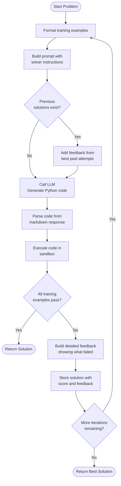
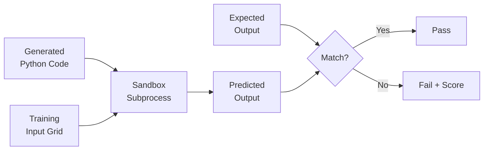

# The Propose-Test-Refine Loop

This is the core innovation that makes Poetiq different from simple single-prompt approaches. Instead of asking an LLM once and hoping for the best, the system engages in an iterative problem-solving loop.

## The Core Insight

> "The prompt is an interface, not the intelligence."

Traditional approach:
```
User → Prompt → LLM → Answer (hope it's right)
```

Poetiq approach:
```
User → Prompt → LLM → Code → Test → Feedback → LLM → Better Code → ...
```

The LLM is just one component. The intelligence emerges from the **loop**.

## The Iteration Loop



## Phase 1: PROPOSE

The LLM doesn't answer the puzzle directly. It generates **Python code** that implements a transformation function.

### Why Code Instead of Direct Answers?

| Approach | Problem |
|----------|---------|
| Direct answer | LLM must solve AND format output perfectly |
| Generate code | LLM reasons about the pattern, code handles formatting |

Code acts as a **verifiable hypothesis**. The LLM says "I think the pattern is X" and expresses it as code that can be tested.

### The Prompt Structure

```
<Problem>
Here are the training examples:

Example 1:
Input: [grid diagram]
Output: [grid diagram]

Example 2:
Input: [grid diagram]
Output: [grid diagram]
</Problem>

<Instructions>
Analyze the examples to find the transformation pattern.
Write a Python function: def transform(grid: np.ndarray) -> np.ndarray
</Instructions>
```

The system uses ASCII diagrams (not raw JSON) because they're more readable for LLMs:
```
Input:
0 0 1
0 1 0
1 0 0

Output:
1 1 1
1 1 1
1 1 1
```

## Phase 2: TEST

Generated code runs in an isolated sandbox against **all training examples**.

### Why Sandbox Execution?

1. **Safety**: LLM-generated code might have bugs or be malicious
2. **Isolation**: Each test runs in a fresh environment
3. **Timeout**: Prevents infinite loops (1.5s limit)
4. **Reproducibility**: `PYTHONHASHSEED=0` ensures consistent behavior

### What Gets Tested

For each training example:
1. Run `transform(input_grid)` → predicted output
2. Compare predicted vs expected output
3. Record success/failure and accuracy



## Phase 3: REFINE

If the code doesn't pass all examples, the system builds **structured feedback** to guide the next iteration.

### Feedback Components

1. **Per-example status**: "Solves Example #1 correctly" or "incorrectly"
2. **Shape analysis**: If dimensions mismatch, explain expected vs actual
3. **Visual diff**: For same-shape failures, show grid with `prediction/expected` format
4. **Accuracy score**: 0.0 to 1.0 measuring pixel-level correctness

### Example Feedback

```
Your code's output does not match the expected output for Example 2.

Visualization with predictions shown as 'prediction/correct':
0/1  1/1  0/1
1/0  1/1  1/1
0/0  0/0  1/1

Output accuracy: 0.56 (0 is worst, 1 is best).
```

This tells the LLM:
- Row 1, Column 1: You predicted 0, should be 1
- Row 2, Column 1: You predicted 1, should be 0
- The solution is 56% correct

### Why This Beats Single Prompts

| Single Prompt | Iterative Refinement |
|---------------|----------------------|
| One chance to get it right | Multiple attempts with learning |
| No feedback on errors | Detailed feedback guides improvement |
| All-or-nothing | Partial progress tracked |
| Same result every time | Different seeds explore solution space |

## The Power of Iteration

### Iteration 1: Initial Hypothesis
LLM: "I think the pattern is to flip the grid horizontally"
→ Code fails on 2/3 examples

### Iteration 2: Refined Hypothesis
LLM (with feedback): "The flip was wrong. Looking at the failures, I see it's actually a 90-degree rotation"
→ Code passes all examples!

Without iteration, the system would have returned the wrong answer. With iteration, it **learns from mistakes**.

## Configuration Knobs

| Parameter | Default | Purpose |
|-----------|---------|---------|
| `max_iterations` | 10 | Maximum attempts per problem |
| `max_solutions` | 5 | How many past solutions to show |
| `selection_probability` | 1.0 | Probability of including each past solution |
| `improving_order` | true | Show solutions worst-to-best (negative examples) |
| `shuffle_examples` | true | Randomize training example order |

### Why Shuffle Examples?

Different orderings can lead to different insights:
- Order A: LLM notices color pattern first
- Order B: LLM notices spatial pattern first

By shuffling each iteration, the system explores different "angles" of understanding.

## Key Takeaway

The propose-test-refine loop transforms an LLM from a "one-shot oracle" into a **learning system**. Each iteration:

1. **PROPOSE**: Generate a hypothesis (as code)
2. **TEST**: Verify against known truth (training examples)
3. **REFINE**: Learn from failures (structured feedback)

This is why Poetiq achieves higher accuracy than the underlying LLMs alone—it wraps them in a feedback loop that converts partial knowledge into correct solutions.

## Next Steps

- [03-self-auditing-mechanism.md](./03-self-auditing-mechanism.md) - How the system knows when to stop
- [04-multi-expert-ensemble.md](./04-multi-expert-ensemble.md) - Running multiple experts in parallel
