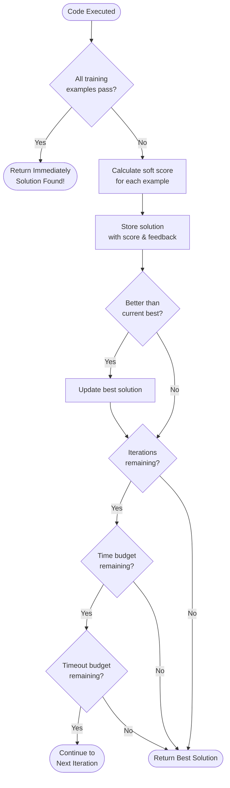
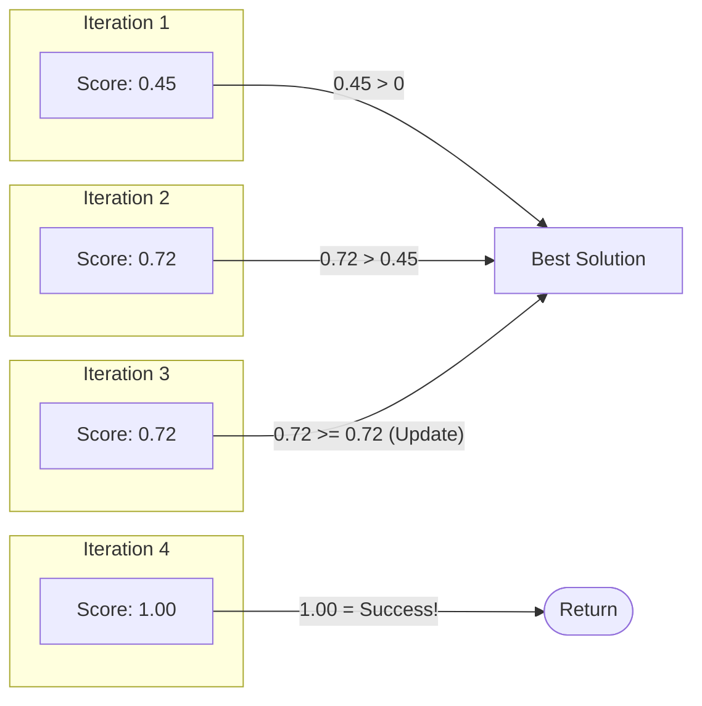
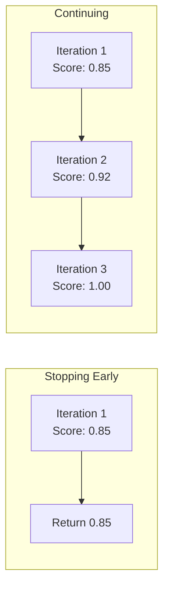

# Self-Auditing Mechanism

One of Poetiq's key innovations is that the system **decides for itself** when a solution is good enough. This "self-auditing" is critical for avoiding wasteful computation and minimizing costs.

## The Core Insight

> "The system autonomously audits its own progress. It decides for itself when it has enough information and the solution is satisfactory."

Most AI systems either:
- Run for a fixed number of steps (wasteful if solved early)
- Return after first attempt (misses easy improvements)

Poetiq finds the optimal stopping point automatically.

## Decision Flow



## Termination Conditions

### 1. Success Detection (Primary)

The system stops **immediately** when all training examples pass:

```
if all(r["success"] for r in train_results):
    return solution  # Done! No more API calls needed.
```

This is the "happy path" that saves the most cost. Why continue iterating if you already have a correct answer?

### 2. Iteration Limit (Secondary)

If no perfect solution is found:
- Run up to `max_iterations` (default: 10)
- Return the best solution found so far

### 3. Time Budget (Tertiary)

Track cumulative time across iterations:
- `max_remaining_time` decrements after each LLM call
- If budget exhausted, stop early

### 4. Timeout Budget (Quaternary)

Track API timeouts:
- `max_total_timeouts` limits failed requests
- If too many timeouts, stop (API might be overloaded)

## Soft Scoring: Measuring Partial Progress

When a solution doesn't pass all examples, how do you know if it's "close"?

### The Soft Score

```
soft_score = (correct pixels) / (total pixels)
```

A score of 0.95 means "95% of the output grid is correct." This is more informative than just pass/fail.

### Why Soft Scoring Matters

| Scenario | Pass/Fail | Soft Score |
|----------|-----------|------------|
| Solution A: 1 pixel wrong | Fail | 0.99 |
| Solution B: Everything wrong | Fail | 0.10 |

Both "fail" but Solution A is clearly better. Soft scoring captures this.

### Shape Mismatch Handling

If predicted shape ≠ expected shape:
```
soft_score = 0.0
```

Shape mismatches are fundamental errors with no partial credit.

## Best Solution Tracking

The system maintains a running "best" solution. Note that if a later iteration achieves the same score, it updates the best (preferring the most recent refined hypothesis).



If iterations exhaust without finding a perfect solution, the best partial solution is returned. This is better than returning nothing.

## Budget Management

Budgets are strictly enforced within the `llm()` wrapper function (`arc_agi/llm.py`), ensuring that no single problem consumes excessive resources regardless of the number of iterations.

### Time Tracking

```
Request 1: 5.2 seconds → remaining: 294.8s
Request 2: 8.1 seconds → remaining: 286.7s
Request 3: 12.3 seconds → remaining: 274.4s
...
Request N: remaining < request_timeout → Stop
```

### Timeout Tracking

```
Request 1: Success → timeouts: 0
Request 2: Timeout → timeouts: 1
Request 3: Timeout → timeouts: 2
...
Timeouts >= max_total_timeouts → Stop
```

## Why Self-Auditing Reduces Cost

### Traditional Approach

```
Always run 10 iterations
→ 10 LLM calls per problem
→ High cost, often unnecessary
```

### Poetiq Approach

```
Stop when solution found
→ Average: <2 LLM calls per problem
→ Lower cost, same or better accuracy
```

The blog post notes: "Our systems achieve this because they make only a single attempt that uses fewer than two requests on average."

## Cost-Quality Trade-off



The system balances:
- **Early stopping**: Saves cost but might miss improvements
- **Full iteration**: Better results but higher cost

By tracking soft scores, the system knows when continuing is likely to help.

## Configuration Options

| Parameter | Purpose |
|-----------|---------|
| `max_iterations` | Hard limit on attempts |
| `max_total_time` | Time budget in seconds |
| `max_total_timeouts` | Timeout tolerance |
| `return_best_result` | Whether to return best partial solution |

### When to Return Best vs Nothing

If `return_best_result = true`:
- Return best solution even if not perfect
- Useful when partial solutions have value

If `return_best_result = false`:
- Return empty if no perfect solution
- Useful when only correct solutions matter

## Key Takeaway

Self-auditing transforms the system from "run for N steps" to "run until good enough." This:

1. **Saves cost** by stopping early on easy problems
2. **Improves quality** by continuing on hard problems
3. **Manages risk** through budget limits
4. **Tracks progress** via soft scoring

The system doesn't just run—it **thinks about whether to keep running**.

## Next Steps

- [04-multi-expert-ensemble.md](./04-multi-expert-ensemble.md) - Running multiple experts for diversity
- [05-llm-integration-patterns.md](./05-llm-integration-patterns.md) - Patterns for LLM integration
