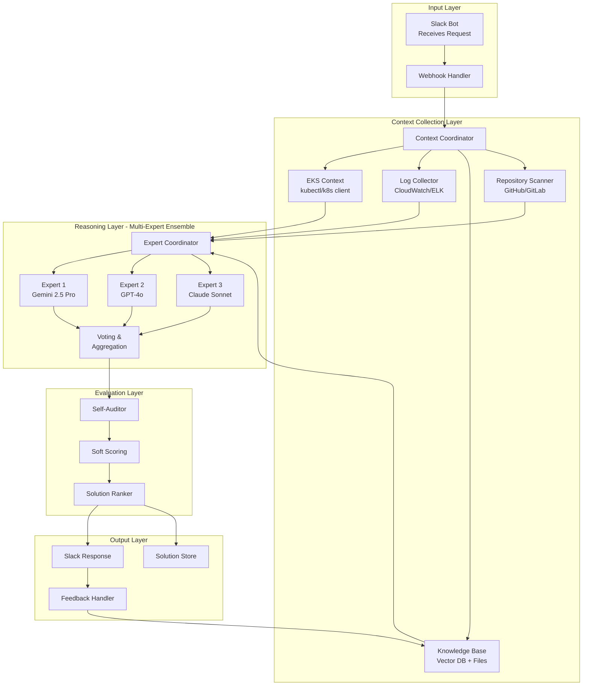
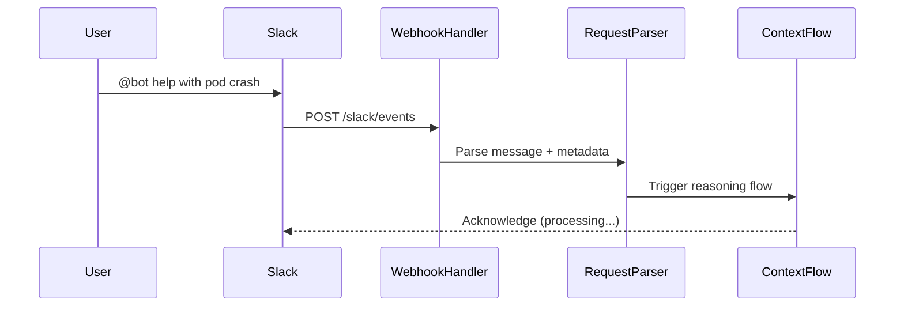
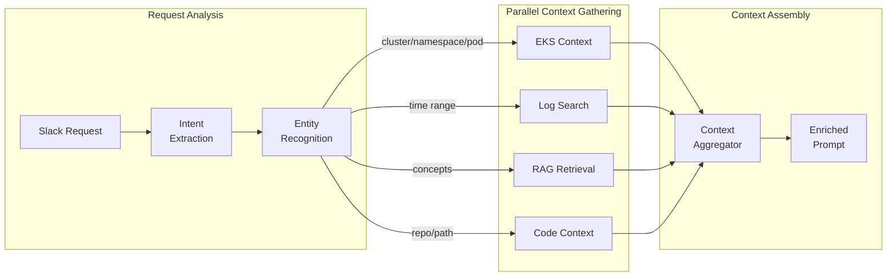
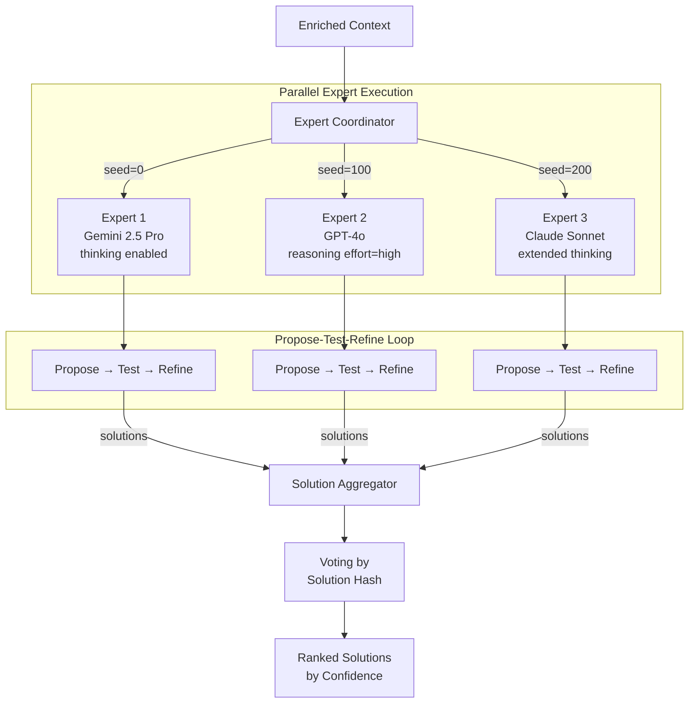
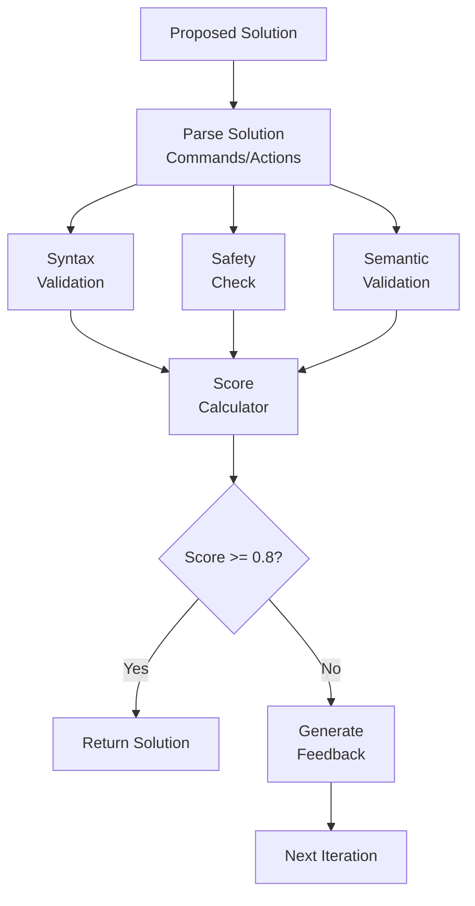
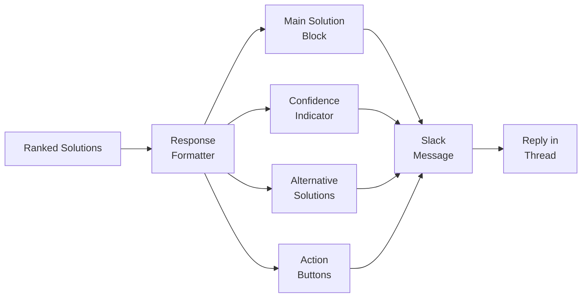

# LLM-Powered Reasoning System Design Document

A high-level architecture for building intelligent reasoning systems using Go, Genkit, and Poetiq patterns for Kubernetes/EKS troubleshooting via Slack.

## Executive Summary

This design document describes a system that:
- Receives troubleshooting requests via Slack
- Collects comprehensive context from EKS clusters, logs, and knowledge bases
- Uses multi-expert ensemble with multiple LLMs for solution generation
- Self-audits and scores solutions before presenting
- Learns from user feedback for continuous improvement

---

## System Architecture Overview



---

## Phase 1: Slack Request Handling

### Architecture



### Genkit Implementation

```go
package slack

import (
    "context"
    "github.com/firebase/genkit/go/genkit"
    "github.com/slack-go/slack"
)

type SlackRequest struct {
    ChannelID   string   `json:"channel_id"`
    UserID      string   `json:"user_id"`
    Message     string   `json:"message"`
    ThreadTS    string   `json:"thread_ts,omitempty"`
    Attachments []string `json:"attachments,omitempty"`
}

type ReasoningResponse struct {
    Solution    string   `json:"solution"`
    Confidence  float64  `json:"confidence"`
    Sources     []string `json:"sources"`
    Suggestions []string `json:"suggestions"`
}

// Define the main reasoning flow
var reasoningFlow = genkit.DefineFlow(g, "troubleshootingFlow",
    func(ctx context.Context, req SlackRequest) (ReasoningResponse, error) {
        // 1. Collect context
        context, err := collectContext(ctx, req)
        if err != nil {
            return ReasoningResponse{}, err
        }

        // 2. Run multi-expert reasoning
        solutions, err := runExpertEnsemble(ctx, context)
        if err != nil {
            return ReasoningResponse{}, err
        }

        // 3. Evaluate and rank
        best := evaluateAndRank(ctx, solutions)

        // 4. Store for learning
        storeSolution(ctx, req, best)

        return best, nil
    })
```

### Key Patterns Applied

| Poetiq Pattern | Application |
|----------------|-------------|
| Model-Agnostic | Slack interface decoupled from LLM layer |
| Early Exit | Acknowledge immediately, process async |
| Structured Feedback | Rich response with confidence + sources |

---

## Phase 2: Context Collection

### Architecture



### Context Sources

```go
type ContextCollector interface {
    Collect(ctx context.Context, query ContextQuery) (ContextResult, error)
}

// EKS Context - Pod status, events, resource usage
type EKSCollector struct {
    clientset *kubernetes.Clientset
}

func (c *EKSCollector) Collect(ctx context.Context, q ContextQuery) (ContextResult, error) {
    // Gather pod status
    pod, _ := c.clientset.CoreV1().Pods(q.Namespace).Get(ctx, q.PodName, metav1.GetOptions{})

    // Gather events
    events, _ := c.clientset.CoreV1().Events(q.Namespace).List(ctx, metav1.ListOptions{
        FieldSelector: fmt.Sprintf("involvedObject.name=%s", q.PodName),
    })

    // Gather logs (last N lines)
    logs, _ := c.clientset.CoreV1().Pods(q.Namespace).GetLogs(q.PodName, &corev1.PodLogOptions{
        TailLines: ptr.To(int64(100)),
    }).Do(ctx).Raw()

    return ContextResult{
        Type: "eks",
        Data: map[string]any{
            "pod_status": pod.Status,
            "events":     events.Items,
            "logs":       string(logs),
        },
    }, nil
}

// RAG Retriever - Knowledge base search
type KnowledgeRetriever struct {
    embedder  ai.Embedder
    vectorDB  VectorStore
}

func (r *KnowledgeRetriever) Collect(ctx context.Context, q ContextQuery) (ContextResult, error) {
    // Generate embedding for query
    embedding, _ := r.embedder.Embed(ctx, &ai.EmbedRequest{
        Documents: []*ai.Document{{Content: q.Question}},
    })

    // Search vector DB
    docs, _ := r.vectorDB.Search(ctx, embedding.Embeddings[0], 5)

    return ContextResult{
        Type: "knowledge",
        Data: map[string]any{
            "documents": docs,
        },
    }, nil
}
```

### Genkit Tools for Context

```go
// Define tools that LLM can call for additional context
var getPodsStatusTool = genkit.DefineTool(g, "getPodStatus",
    "Gets the current status of pods in a namespace",
    func(ctx *ai.ToolContext, input struct {
        Namespace string `json:"namespace"`
        LabelSelector string `json:"label_selector,omitempty"`
    }) (string, error) {
        pods, err := k8sClient.CoreV1().Pods(input.Namespace).List(ctx, metav1.ListOptions{
            LabelSelector: input.LabelSelector,
        })
        if err != nil {
            return "", err
        }
        return formatPodStatus(pods), nil
    })

var searchLogsTool = genkit.DefineTool(g, "searchLogs",
    "Searches logs for error patterns",
    func(ctx *ai.ToolContext, input struct {
        PodName   string `json:"pod_name"`
        Pattern   string `json:"pattern"`
        TimeRange string `json:"time_range"`
    }) (string, error) {
        return searchCloudWatchLogs(ctx, input)
    })

var searchKnowledgeTool = genkit.DefineTool(g, "searchKnowledge",
    "Searches the knowledge base for relevant documentation",
    func(ctx *ai.ToolContext, input struct {
        Query string `json:"query"`
    }) (string, error) {
        return ragRetriever.Search(ctx, input.Query)
    })
```

---

## Phase 3: Multi-Expert Ensemble

### Architecture (Poetiq Pattern)



### Expert Configuration

```go
type ExpertConfig struct {
    ID             string
    Model          string
    Seed           int
    MaxIterations  int
    Temperature    float64
    ThinkingBudget int
    RateLimitRPS   float64
}

var expertConfigs = []ExpertConfig{
    {
        ID:             "gemini-expert",
        Model:          "googleai/gemini-2.5-pro",
        Seed:           0,
        MaxIterations:  5,
        Temperature:    0.7,
        ThinkingBudget: 16000,
        RateLimitRPS:   2.0,
    },
    {
        ID:             "openai-expert",
        Model:          "openai/gpt-4o",
        Seed:           100,
        MaxIterations:  5,
        Temperature:    0.7,
        RateLimitRPS:   1.0,
    },
    {
        ID:             "claude-expert",
        Model:          "anthropic/claude-sonnet-4-5",
        Seed:           200,
        MaxIterations:  5,
        Temperature:    0.7,
        ThinkingBudget: 32000,
        RateLimitRPS:   1.0,
    },
}
```

### Parallel Expert Execution

```go
func runExpertEnsemble(ctx context.Context, context EnrichedContext) ([]ExpertSolution, error) {
    var wg sync.WaitGroup
    results := make(chan ExpertSolution, len(expertConfigs))

    for _, cfg := range expertConfigs {
        wg.Add(1)
        go func(cfg ExpertConfig) {
            defer wg.Done()

            // Create rate limiter for this expert
            limiter := rate.NewLimiter(rate.Limit(cfg.RateLimitRPS), 1)

            // Run propose-test-refine loop
            solution, err := runExpert(ctx, cfg, context, limiter)
            if err != nil {
                log.Printf("Expert %s failed: %v", cfg.ID, err)
                return
            }

            results <- solution
        }(cfg)
    }

    // Wait for all experts
    go func() {
        wg.Wait()
        close(results)
    }()

    // Collect results
    var solutions []ExpertSolution
    for sol := range results {
        solutions = append(solutions, sol)
    }

    return solutions, nil
}
```

### Propose-Test-Refine Loop

```go
func runExpert(ctx context.Context, cfg ExpertConfig,
    context EnrichedContext, limiter *rate.Limiter) (ExpertSolution, error) {

    var bestSolution ExpertSolution
    var feedback []SolutionFeedback

    for i := 0; i < cfg.MaxIterations; i++ {
        // Rate limit
        limiter.Wait(ctx)

        // PROPOSE: Generate solution
        prompt := buildPrompt(context, feedback, cfg.Seed+i)

        resp, err := genkit.Generate(ctx, g,
            ai.WithModelName(cfg.Model),
            ai.WithPrompt(prompt),
            ai.WithConfig(&ai.GenerationConfig{
                Temperature: cfg.Temperature,
            }),
            ai.WithTools(getPodsStatusTool, searchLogsTool, searchKnowledgeTool),
        )
        if err != nil {
            continue
        }

        solution := parseSolution(resp.Text())

        // TEST: Validate solution
        testResult := validateSolution(ctx, solution, context)

        // Early exit if solution passes all tests
        if testResult.AllPassed {
            return ExpertSolution{
                ExpertID:   cfg.ID,
                Solution:   solution,
                Score:      1.0,
                Iterations: i + 1,
                Passed:     true,
            }, nil
        }

        // Track best solution
        if testResult.Score > bestSolution.Score {
            bestSolution = ExpertSolution{
                ExpertID:   cfg.ID,
                Solution:   solution,
                Score:      testResult.Score,
                Iterations: i + 1,
                Passed:     false,
            }
        }

        // REFINE: Build feedback for next iteration
        feedback = append(feedback, SolutionFeedback{
            Solution:  solution,
            Score:     testResult.Score,
            Errors:    testResult.Errors,
            Iteration: i,
        })
    }

    return bestSolution, nil
}
```

### Voting and Aggregation

```go
type SolutionGroup struct {
    Hash       string
    Solutions  []ExpertSolution
    VoteCount  int
    BestScore  float64
    Confidence float64
}

func aggregateSolutions(solutions []ExpertSolution) []SolutionGroup {
    groups := make(map[string]*SolutionGroup)

    for _, sol := range solutions {
        hash := hashSolution(sol.Solution)

        if group, exists := groups[hash]; exists {
            group.Solutions = append(group.Solutions, sol)
            group.VoteCount++
            if sol.Score > group.BestScore {
                group.BestScore = sol.Score
            }
        } else {
            groups[hash] = &SolutionGroup{
                Hash:      hash,
                Solutions: []ExpertSolution{sol},
                VoteCount: 1,
                BestScore: sol.Score,
            }
        }
    }

    // Calculate confidence and sort
    var result []SolutionGroup
    for _, group := range groups {
        group.Confidence = float64(group.VoteCount) / float64(len(solutions))
        result = append(result, *group)
    }

    // Sort: passers first, then by vote count, then by score
    sort.Slice(result, func(i, j int) bool {
        if result[i].BestScore == 1.0 && result[j].BestScore < 1.0 {
            return true
        }
        if result[i].VoteCount != result[j].VoteCount {
            return result[i].VoteCount > result[j].VoteCount
        }
        return result[i].BestScore > result[j].BestScore
    })

    return result
}
```

---

## Phase 4: Evaluation and Scoring

### Self-Auditing Architecture



### Scoring Implementation

```go
type ValidationResult struct {
    AllPassed    bool
    Score        float64
    SyntaxScore  float64
    SafetyScore  float64
    SemanticScore float64
    Errors       []ValidationError
}

func validateSolution(ctx context.Context, solution Solution,
    context EnrichedContext) ValidationResult {

    var result ValidationResult
    var errors []ValidationError

    // 1. Syntax validation - are the commands well-formed?
    syntaxScore, syntaxErrors := validateSyntax(solution)
    result.SyntaxScore = syntaxScore
    errors = append(errors, syntaxErrors...)

    // 2. Safety check - no destructive operations
    safetyScore, safetyErrors := validateSafety(solution)
    result.SafetyScore = safetyScore
    errors = append(errors, safetyErrors...)

    // 3. Semantic validation - does it address the problem?
    semanticScore, semanticErrors := validateSemantics(ctx, solution, context)
    result.SemanticScore = semanticScore
    errors = append(errors, semanticErrors...)

    // Calculate weighted score
    result.Score = (syntaxScore * 0.2) + (safetyScore * 0.3) + (semanticScore * 0.5)
    result.Errors = errors
    result.AllPassed = result.Score >= 0.95 && safetyScore == 1.0

    return result
}

// Semantic validation using LLM-as-judge
func validateSemantics(ctx context.Context, solution Solution,
    context EnrichedContext) (float64, []ValidationError) {

    resp, err := genkit.Generate(ctx, g,
        ai.WithModelName("googleai/gemini-2.5-flash"), // Fast model for evaluation
        ai.WithPrompt(buildEvaluationPrompt(solution, context)),
    )
    if err != nil {
        return 0.5, []ValidationError{{Message: "Evaluation failed"}}
    }

    evalResult := parseEvaluationResponse(resp.Text())
    return evalResult.Score, evalResult.Issues
}
```

### Genkit Custom Evaluator

```go
var solutionEvaluator = genkit.DefineEvaluator(g,
    api.NewName("k8s", "solutionEvaluator"),
    &ai.EvaluatorOptions{
        DisplayName: "K8s Solution Evaluator",
        Definition:  "Evaluates if a solution correctly addresses the K8s issue",
    },
    func(ctx context.Context, req *ai.EvaluatorCallbackRequest) (*ai.EvaluatorCallbackResponse, error) {
        solution := req.Input
        reference := req.Reference

        scores := []ai.Score{
            {
                Name:  "correctness",
                Score: evaluateCorrectness(solution, reference),
            },
            {
                Name:  "safety",
                Score: evaluateSafety(solution),
            },
            {
                Name:  "completeness",
                Score: evaluateCompleteness(solution),
            },
        }

        return &ai.EvaluatorCallbackResponse{
            TestCaseId: req.TestCaseId,
            Evaluation: scores,
        }, nil
    })
```

---

## Phase 5: Slack Response

### Response Architecture



### Response Implementation

```go
type SlackResponse struct {
    Blocks []slack.Block
}

func formatSlackResponse(result ReasoningResponse, groups []SolutionGroup) SlackResponse {
    blocks := []slack.Block{
        // Header
        slack.NewHeaderBlock(slack.NewTextBlockObject(
            "plain_text", "Solution Found", false, false)),

        // Confidence indicator
        slack.NewSectionBlock(
            slack.NewTextBlockObject("mrkdwn", formatConfidence(result.Confidence)),
            nil, nil),

        // Main solution
        slack.NewSectionBlock(
            slack.NewTextBlockObject("mrkdwn", result.Solution),
            nil, nil),

        slack.NewDividerBlock(),

        // Sources
        slack.NewContextBlock(
            slack.NewTextBlockObject("mrkdwn", formatSources(result.Sources))...),
    }

    // Action buttons
    blocks = append(blocks, slack.NewActionBlock(
        "feedback_actions",
        slack.NewButtonBlockElement("solved", "solved",
            slack.NewTextBlockObject("plain_text", "This solved it!", true, false)),
        slack.NewButtonBlockElement("not_helpful", "not_helpful",
            slack.NewTextBlockObject("plain_text", "Not helpful", true, false)),
        slack.NewButtonBlockElement("show_alternatives", "alternatives",
            slack.NewTextBlockObject("plain_text", "Show alternatives", true, false)),
    ))

    return SlackResponse{Blocks: blocks}
}

func formatConfidence(conf float64) string {
    switch {
    case conf >= 0.8:
        return "Confidence: High (multiple experts agree)"
    case conf >= 0.5:
        return "Confidence: Medium"
    default:
        return "Confidence: Low (experts disagree - review carefully)"
    }
}
```

---

## Phase 6: Feedback Loop and Learning

### Feedback Architecture

```mermaid
flowchart TD
    subgraph "User Feedback Collection"
        BTN[Slack Button<br/>Click] --> HANDLER[Feedback<br/>Handler]
        REPLY[Thread Reply<br/>"Actually..."] --> HANDLER
    end

    subgraph "Feedback Processing"
        HANDLER --> CLASSIFY[Classify<br/>Feedback Type]
        CLASSIFY --> |positive| SUCCESS[Mark as<br/>Successful]
        CLASSIFY --> |negative| FAILURE[Mark as<br/>Failed]
        CLASSIFY --> |correction| CORRECT[Store<br/>Correction]
    end

    subgraph "Knowledge Update"
        SUCCESS --> EMBED[Generate<br/>Embedding]
        FAILURE --> EMBED
        CORRECT --> EMBED
        EMBED --> VECTOR[Store in<br/>Vector DB]
        EMBED --> EXAMPLES[Update<br/>Few-Shot Examples]
    end

    subgraph "Retrieval Enhancement"
        VECTOR --> RAG[Enhanced<br/>RAG Context]
        EXAMPLES --> PROMPT[Improved<br/>Prompts]
    end
```

### Feedback Implementation

```go
type Feedback struct {
    ID           string    `json:"id"`
    RequestID    string    `json:"request_id"`
    SolutionHash string    `json:"solution_hash"`
    Type         string    `json:"type"` // "positive", "negative", "correction"
    UserID       string    `json:"user_id"`
    Comment      string    `json:"comment,omitempty"`
    Timestamp    time.Time `json:"timestamp"`
}

type FeedbackStore interface {
    Store(ctx context.Context, fb Feedback) error
    GetByRequest(ctx context.Context, requestID string) ([]Feedback, error)
    GetSuccessfulSolutions(ctx context.Context, limit int) ([]Solution, error)
}

// Slack interaction handler
func handleSlackInteraction(ctx context.Context, callback slack.InteractionCallback) error {
    action := callback.ActionCallback.BlockActions[0]

    feedback := Feedback{
        ID:        uuid.New().String(),
        RequestID: callback.Message.ThreadTimestamp,
        UserID:    callback.User.ID,
        Timestamp: time.Now(),
    }

    switch action.ActionID {
    case "solved":
        feedback.Type = "positive"
        // Update knowledge base with successful solution
        if err := updateKnowledgeBase(ctx, feedback); err != nil {
            log.Printf("Failed to update KB: %v", err)
        }

    case "not_helpful":
        feedback.Type = "negative"
        // Prompt for more details
        return requestFeedbackDetails(ctx, callback)

    case "alternatives":
        // Show alternative solutions from other experts
        return showAlternatives(ctx, callback)
    }

    return feedbackStore.Store(ctx, feedback)
}

// Update knowledge base with successful solutions
func updateKnowledgeBase(ctx context.Context, fb Feedback) error {
    // Get original request and solution
    request, _ := requestStore.Get(ctx, fb.RequestID)
    solution, _ := solutionStore.GetByHash(ctx, fb.SolutionHash)

    // Create knowledge document
    doc := KnowledgeDocument{
        Problem:   request.Message,
        Solution:  solution.Content,
        Context:   solution.Context,
        Validated: true,
        Score:     1.0, // User confirmed it works
    }

    // Generate embedding
    embedding, err := embedder.Embed(ctx, &ai.EmbedRequest{
        Documents: []*ai.Document{{
            Content: fmt.Sprintf("Problem: %s\nSolution: %s", doc.Problem, doc.Solution),
        }},
    })
    if err != nil {
        return err
    }

    // Store in vector DB
    return vectorDB.Upsert(ctx, doc.ID, embedding.Embeddings[0], doc)
}
```

### Learning from Corrections

```go
// When user provides a correction in thread
func handleThreadCorrection(ctx context.Context, event slack.MessageEvent) error {
    // Extract correction from message
    correction := event.Text

    // Get original problem and solution
    original, _ := getOriginalContext(ctx, event.ThreadTimestamp)

    // Store as training example
    example := TrainingExample{
        ID:          uuid.New().String(),
        Problem:     original.Problem,
        BadSolution: original.Solution,
        GoodSolution: correction,
        Timestamp:   time.Now(),
    }

    if err := trainingStore.Store(ctx, example); err != nil {
        return err
    }

    // Update few-shot examples for future prompts
    return updateFewShotExamples(ctx, example)
}

// Use successful solutions as few-shot examples
func buildPromptWithExamples(ctx context.Context, problem string) string {
    // Retrieve similar successful solutions
    examples, _ := feedbackStore.GetSuccessfulSolutions(ctx, 3)

    prompt := "You are a Kubernetes troubleshooting expert.\n\n"
    prompt += "Here are some examples of successfully resolved issues:\n\n"

    for i, ex := range examples {
        prompt += fmt.Sprintf("Example %d:\nProblem: %s\nSolution: %s\n\n",
            i+1, ex.Problem, ex.Solution)
    }

    prompt += fmt.Sprintf("Now solve this issue:\nProblem: %s\n", problem)

    return prompt
}
```

---

## Complete Data Flow Diagram

```mermaid
flowchart TB
    subgraph "1. Request"
        U[User] -->|@bot help| S[Slack]
        S --> WH[Webhook]
    end

    subgraph "2. Context"
        WH --> CC[Context<br/>Coordinator]
        CC --> |parallel| EKS[EKS<br/>Status]
        CC --> |parallel| CW[CloudWatch<br/>Logs]
        CC --> |parallel| VDB[(Vector<br/>DB)]
        CC --> |parallel| GH[GitHub<br/>Repo]
    end

    subgraph "3. Reasoning"
        EKS & CW & VDB & GH --> AGG[Aggregator]
        AGG --> |parallel| GEM[Gemini<br/>Expert]
        AGG --> |parallel| GPT[GPT-4o<br/>Expert]
        AGG --> |parallel| CLD[Claude<br/>Expert]

        GEM --> |PTR loop| GEM
        GPT --> |PTR loop| GPT
        CLD --> |PTR loop| CLD
    end

    subgraph "4. Evaluate"
        GEM & GPT & CLD --> VOTE[Voting]
        VOTE --> AUDIT[Self-Audit]
        AUDIT --> RANK[Rank]
    end

    subgraph "5. Response"
        RANK --> FMT[Format]
        FMT --> RESP[Slack<br/>Response]
    end

    subgraph "6. Learn"
        RESP --> FB[Feedback<br/>Buttons]
        FB --> |positive| KB[Knowledge<br/>Base]
        FB --> |negative| IMP[Improvement<br/>Queue]
        KB --> VDB
    end
```

---

## Project Structure

```
k8s-reasoning-system/
├── cmd/
│   └── server/
│       └── main.go              # Entry point, Genkit init
├── internal/
│   ├── slack/
│   │   ├── handler.go           # Webhook handlers
│   │   ├── formatter.go         # Response formatting
│   │   └── interactions.go      # Button/interaction handlers
│   ├── context/
│   │   ├── collector.go         # Context coordinator
│   │   ├── eks.go               # EKS context collector
│   │   ├── logs.go              # Log collector
│   │   └── retriever.go         # RAG retriever
│   ├── reasoning/
│   │   ├── coordinator.go       # Expert coordinator
│   │   ├── expert.go            # Single expert logic
│   │   ├── ptr_loop.go          # Propose-Test-Refine
│   │   └── voting.go            # Solution aggregation
│   ├── evaluation/
│   │   ├── validator.go         # Solution validation
│   │   ├── scorer.go            # Soft scoring
│   │   └── evaluator.go         # Genkit evaluator
│   ├── storage/
│   │   ├── postgres.go          # PostgreSQL + pgvector
│   │   ├── solutions.go         # Solution store
│   │   └── feedback.go          # Feedback store
│   └── config/
│       ├── experts.go           # Expert configurations
│       └── models.go            # Model properties
├── pkg/
│   ├── prompts/
│   │   ├── templates.go         # Prompt templates
│   │   └── feedback.go          # Feedback wrappers
│   └── tools/
│       ├── kubectl.go           # kubectl tool
│       ├── logs.go              # Log search tool
│       └── knowledge.go         # Knowledge search tool
├── deployments/
│   ├── kubernetes/
│   │   └── deployment.yaml
│   └── terraform/
├── .env.example
├── go.mod
└── README.md
```

---

## Configuration

```go
// config/experts.go
package config

type Config struct {
    Experts       []ExpertConfig     `yaml:"experts"`
    Models        map[string]ModelProps `yaml:"models"`
    Evaluation    EvaluationConfig   `yaml:"evaluation"`
    Slack         SlackConfig        `yaml:"slack"`
    Storage       StorageConfig      `yaml:"storage"`
}

type ModelProps struct {
    ThinkingBudget  int     `yaml:"thinking_budget,omitempty"`
    ReasoningEffort string  `yaml:"reasoning_effort,omitempty"`
    RateLimitRPS    float64 `yaml:"rate_limit_rps"`
}

// Example config.yaml
/*
experts:
  - id: gemini-expert
    model: googleai/gemini-2.5-pro
    max_iterations: 5
    temperature: 0.7
  - id: openai-expert
    model: openai/gpt-4o
    max_iterations: 5
    temperature: 0.7
  - id: claude-expert
    model: anthropic/claude-sonnet-4-5
    max_iterations: 5
    temperature: 0.7

models:
  googleai/gemini-2.5-pro:
    thinking_budget: 16000
    rate_limit_rps: 2.0
  openai/gpt-4o:
    reasoning_effort: high
    rate_limit_rps: 1.0
  anthropic/claude-sonnet-4-5:
    thinking_budget: 32000
    rate_limit_rps: 1.0

evaluation:
  min_confidence: 0.6
  require_safety_pass: true

storage:
  postgres_url: postgres://localhost:5432/reasoning
  vector_dimensions: 768
*/
```

---

## Key Design Principles Applied

| Poetiq Principle | Implementation |
|------------------|----------------|
| **Prompt = Interface** | Genkit flows separate prompt logic from execution |
| **Verifiable Outputs** | Validation against K8s state, syntax checks |
| **Soft Scoring** | Weighted scores (syntax 20%, safety 30%, semantic 50%) |
| **Diversity** | 3 experts with different seeds and models |
| **Voting = Confidence** | Solution grouping by hash, confidence from agreement |
| **Early Exit** | Stop PTR loop when solution passes validation |
| **Model-Agnostic** | Genkit abstracts LLM providers |
| **Feedback Focus** | Structured error messages guide refinement |

---

## Next Steps

1. **MVP Implementation**: Start with single expert, basic K8s context
2. **Add Multi-Expert**: Parallelize with goroutines
3. **Implement Voting**: Group and rank solutions
4. **Build Feedback Loop**: Slack buttons, knowledge updates
5. **Production Hardening**: Rate limits, timeouts, monitoring
