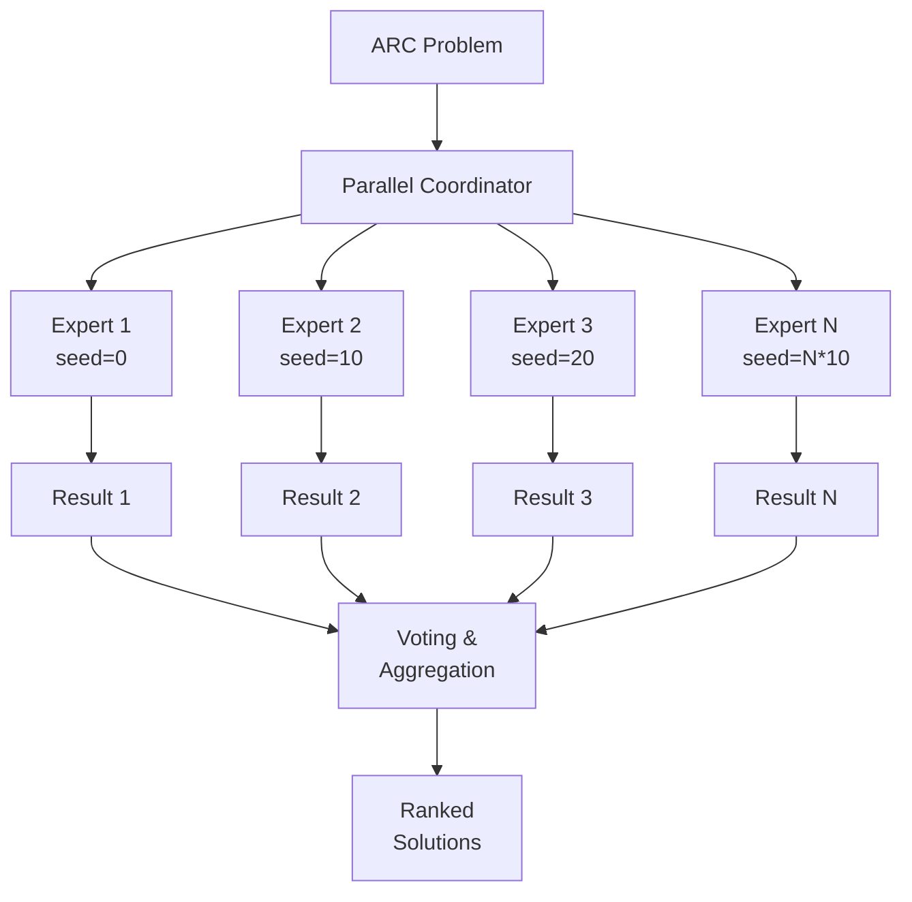
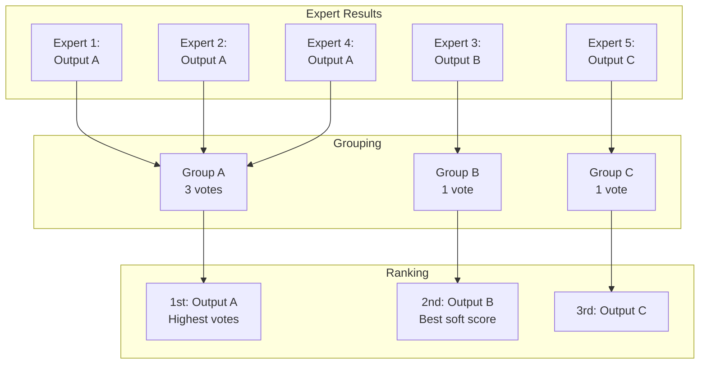
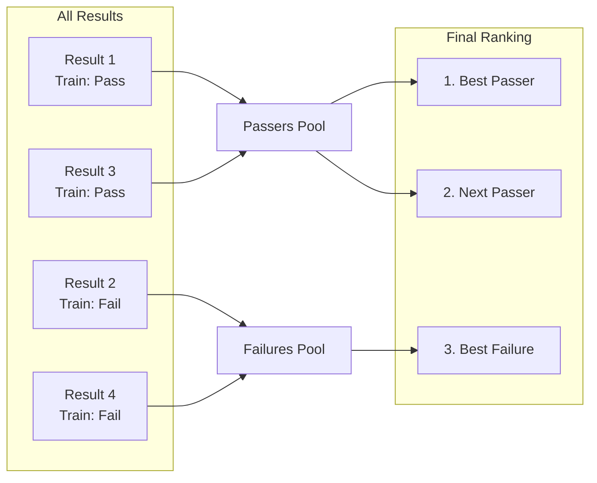

# Multi-Expert Ensemble

Poetiq runs multiple "experts" in parallel, each exploring the solution space independently. Then it aggregates their results through voting. This achieves both diversity and confidence.

## The Core Insight

Single solver problems:
- Gets stuck in local optima
- One bad starting point → no solution
- No confidence measure

Multiple experts solve this:
- Different starting points explore more space
- If multiple experts agree → high confidence
- Diversity + voting = Pareto-optimal results

## Parallel Execution Architecture



## Why Parallel, Not Sequential?

| Sequential | Parallel |
|------------|----------|
| Expert 2 waits for Expert 1 | All run simultaneously |
| Total time = N × single time | Total time ≈ single time |
| Can't leverage modern async | Natural fit for async/await |

Using `asyncio.gather()`, all experts run concurrently:

```
Time with 1 expert:  ~30 seconds
Time with 8 experts: ~35 seconds (not 240 seconds!)
```

## Seed-Based Diversity

Each expert gets a different random seed:

```
Expert 1: seed = base_seed + 0 * max_iterations = 0
Expert 2: seed = base_seed + 1 * max_iterations = 10
Expert 3: seed = base_seed + 2 * max_iterations = 20
```

This affects:
- **Example shuffling**: Different orderings of training examples
- **Solution selection**: Which past solutions to include in feedback
- **LLM sampling**: Different random choices at temperature > 0

Same prompt, different random paths → different solutions explored.

## The Voting Mechanism



### Grouping by Output

Solutions are grouped by their **test output** (using a canonical string representation of the result list):
- Output A: `[[1,2],[3,4]]` → `[[1,2],[3,4]]`
- Output A': `[[1,2],[3,4]]` → `[[1,2],[3,4]]` (same group)
- Output B: `[[5,6],[7,8]]` → `[[5,6],[7,8]]` (different group)

### Ranking Strategy

1. **Passers first**: Solutions that pass all training examples
2. **By vote count**: More experts agreeing = higher confidence
3. **By iterations (optional)**: Break ties by preferring solutions found earlier (or later)
4. **By soft score**: For further ties, prefer higher accuracy
5. **Diversity-first**: Pick one from each group before repeating

## Passers vs Failures



**Passers** = solutions that work on all training examples
- Likely to work on test examples too
- Ranked by vote count

**Failures** = solutions that don't pass all training
- Included as backup (sometimes training isn't representative)
- Ranked by soft score (closest to correct)

## Configuration: Poetiq Variants

The number of experts determines the variant:

| Variant | Experts | Cost | Accuracy |
|---------|---------|------|----------|
| Poetiq (a) | 1 | Lowest | Good |
| Poetiq (b) | 2 | Medium | Better |
| Poetiq (c) | 8 | Highest | Best |

```
# In config.py
NUM_EXPERTS = 1  # Poetiq(Gemini-3-a)
# NUM_EXPERTS = 2  # Poetiq(Gemini-3-b)
# NUM_EXPERTS = 8  # Poetiq(Gemini-3-c)
```

## Why This Achieves Pareto-Optimal Results

The blog post shows Poetiq "redraws the Pareto frontier":

```
                    ▲ Accuracy
                    │
             ●      │  ● = Poetiq variants
           ●        │  ○ = Competing systems
         ●          │
       ○            │
      ○             │
     ○              │
    ○               │
   ─────────────────┴────────► Cost
```

At every cost level, Poetiq achieves higher accuracy. This comes from:

1. **Voting reduces noise**: Random LLM errors average out
2. **Diversity finds solutions**: Different paths explore more space
3. **Early exit saves cost**: Don't iterate if already solved
4. **Confidence ranking**: Best solutions bubble to top

## Handling Agreement

### High Agreement (Good Signal)
```
5/8 experts produce Output A → High confidence
Use Output A as primary answer
```

### Low Agreement (Uncertain)
```
Each expert produces different output → Low confidence
Still pick most common, but lower certainty
```

### Mixed with Failures
When `count_failed_matches = true`:
- Failures that match a passer's output → added to passer's vote count
- Reasoning: If a failure produces the same answer, it adds evidence

## Practical Example

**Problem**: Transform grid with unknown pattern

| Expert | Training | Test Output | Status |
|--------|----------|-------------|--------|
| 1 | Pass | [[1,2,3]] | Passer |
| 2 | Pass | [[1,2,3]] | Passer |
| 3 | Fail (0.9) | [[1,2,3]] | Failure |
| 4 | Pass | [[4,5,6]] | Passer |

**Result**:
1. Output [[1,2,3]]: 2 passers + 1 matching failure = 3 votes
2. Output [[4,5,6]]: 1 passer = 1 vote

→ [[1,2,3]] wins with higher confidence

## Key Takeaway

Multi-expert ensemble achieves:

1. **Exploration**: Different seeds find different solutions
2. **Confidence**: Agreement measures solution quality
3. **Robustness**: Single bad expert doesn't ruin results
4. **Scalability**: More experts = better results (diminishing returns)

The system is **more than the sum of its parts**—collective intelligence emerges from independent exploration and democratic voting.

## Next Steps

- [05-llm-integration-patterns.md](./05-llm-integration-patterns.md) - Patterns for LLM integration
- [06-lessons-learned.md](./06-lessons-learned.md) - Key insights for your projects
